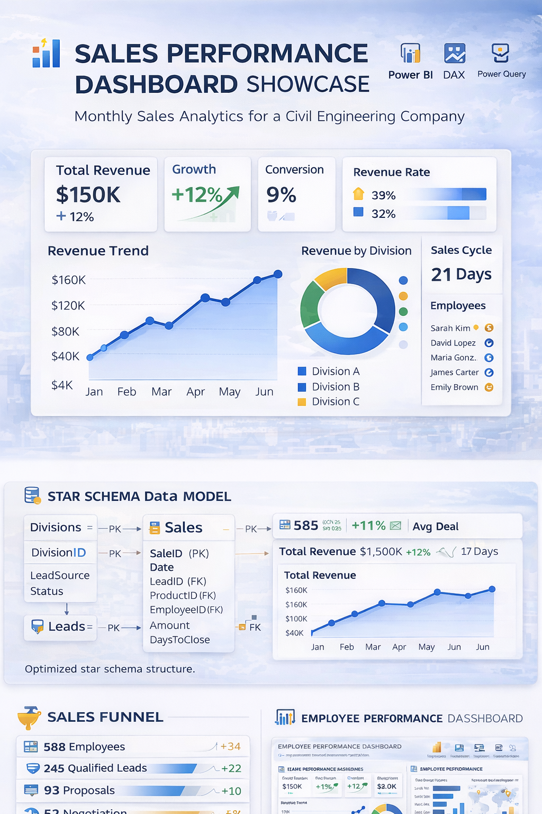
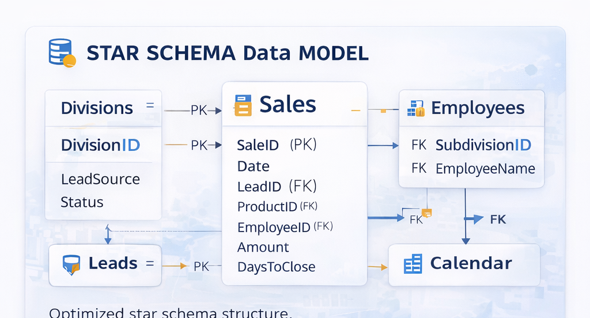
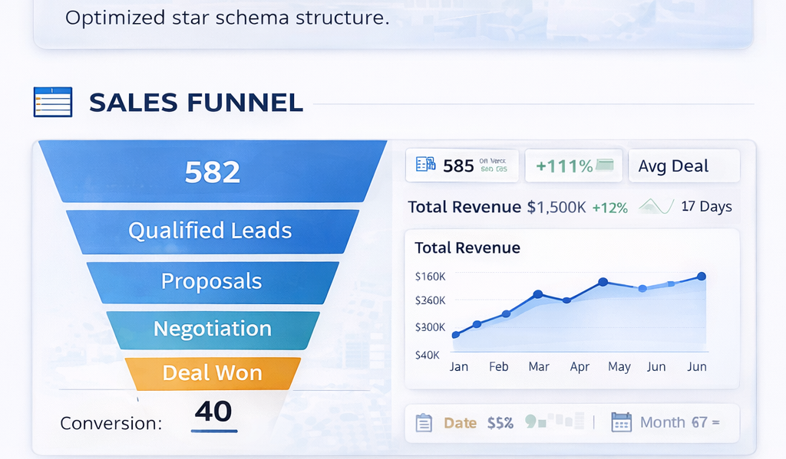
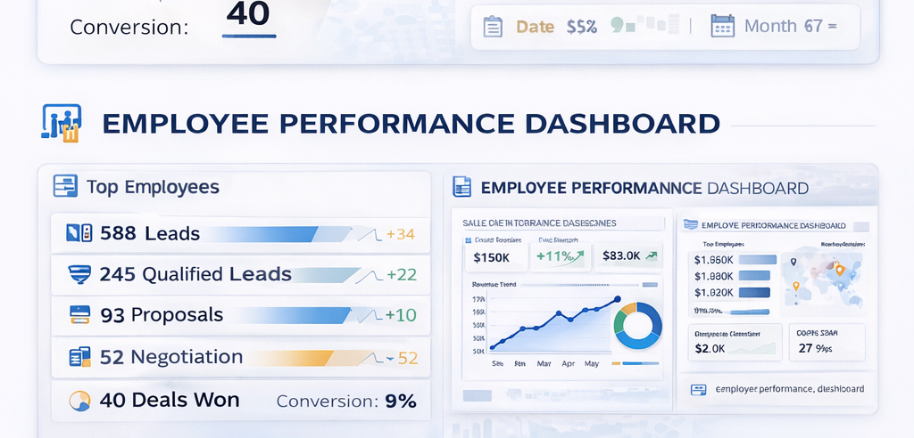

# 📊 Sales Performance Dashboard — Power BI Analytics Project


## 📌 Project Overview

This project presents a **Sales Performance Dashboard developed in Power BI** for a **civil engineering company** that operates across multiple **divisions, subdivisions, and employees**.

The objective of this project is to build a **monthly analytics dashboard** that enables leadership to monitor performance and make **data-driven decisions**.

The dashboard consolidates operational datasets into a **single analytical platform**, allowing management to track revenue growth, sales efficiency, lead conversion performance, employee productivity, division performance, and sales cycle duration.

## 🏗 Business Context

The company operates in the **civil engineering and infrastructure sector**, delivering projects across different operational units.

```text
Division
   └── Subdivision
          └── Employees
```

Each employee manages leads and closes deals related to engineering services. Management required a centralized reporting platform to track performance across the organization on a monthly basis.

## 🎯 Business Problem

**How can the company monitor monthly sales performance across divisions, subdivisions, and employees to identify growth opportunities and operational inefficiencies?**

Key analytical questions:
- Is revenue increasing month over month?
- Which divisions generate the most revenue?
- Which employees close the most deals?
- How efficient is the sales funnel?
- How long does it take to close a deal?

## 📊 Dashboard Overview



## 🗂 Data Model

The dashboard uses a **star schema** centered on the sales fact table.

### Datasets
- `sales.csv` → fact table with closed deals
- `leads.csv` → pipeline and conversion stages
- `employees.csv` → organizational hierarchy with divisions and subdivisions

### Star Schema Diagram



## 🔄 Sales Funnel Pipeline

The sales funnel visualization helps stakeholders understand the movement from generated leads to closed deals and where conversion losses happen.



## 👥 Employee Performance Dashboard

This page focuses on individual and team performance, helping management compare revenue generation, conversion efficiency, and deal activity by employee, subdivision, and division.



## ⚙️ Key DAX Measures

```DAX
Total Revenue = SUM(sales[Amount])
Deals Closed = COUNTROWS(sales)
Total Leads = COUNTROWS(leads)
Conversion Rate = DIVIDE([Deals Closed], [Total Leads], 0)
Average Deal Size = DIVIDE([Total Revenue], [Deals Closed], 0)
Sales Cycle Length = AVERAGE(sales[DaysToClose])
```

## 📅 Reporting Frequency

The dashboard is designed for **monthly performance reporting**. Each refresh supports:
- Revenue growth tracking
- Employee performance review
- Division comparison
- Pipeline monitoring

## 📂 Repository Structure

```text
sales-dashboard-project/
├── README.md
├── dataset/
│   ├── sales.csv
│   ├── leads.csv
│   └── employees.csv
├── docs/
│   └── power_bi_build_guide.md
└── images/
    ├── dashboard_overview.png
    ├── dashboard_portfolio_overview.png
    ├── dashboard_readme_overview.png
    ├── star_schema_data_model.png
    ├── sales_funnel_pipeline.png
    └── employee_performance_dashboard_preview.png
```
